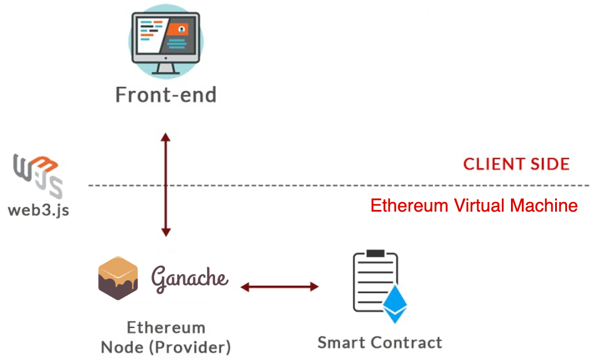

# Decentralized Homework Submission Tracker

- There are GIFs, please use this Github Repo to view.
- This is Decentralized App
- Built on Etherrum

## Setup Development Environment

### Simple Architecture



### Vocabulary

- Gas: refers to the unit used to measure the computational effort need for transactions on the Ethereum network. Each operation in a smart contract requires a certain amount of gas to be executed.

- Gas Limit: when you deploy a smart contract on Remix, you can specify GAS LIMIT. This is important because it prevents infinite loops and other malicious behavior by ensuring that computations have a finite cost.

- Gas Fees: Every operation or transaction on the Ethereum blockchain requires a certain amount of gas. Gas fees are calculated based on the computational resources required to execute the operation or transaction.

### Requirements

- Latest Node and NPM
- Ganache from [https://archive.trufflesuite.com/ganache/](https://archive.trufflesuite.com/ganache/)
- Ganache CLI in Docker (optional)
  - Use the provided [Dockerfile](./Dockerfile)
- Docker (optional)

### Assumptions:

- The project has the uploading file and hash file. However, due to the unnecessary of the uploading file to the bucket like AWS, I simplify the process by obtaining a SHA256 hash of the file, and assume the file has been uploaded to the bucket.

### Setup Ganache CLI with Docker

In the `P-HW5-Vo` directory, run the following command to build a Docker Image:

    docker build -t ganache .

After the image built successfully, run the image in a new container:

    docker run -p 8545:8545 ganache

We will run the GANACHE CLI on `localhost`, port `8545`. This will initilize 10 accounts, each has its own address and 100 ETH.

    Ganache CLI v6.12.2 (ganache-core: 2.13.2)

    Available Accounts
    ==================
    (0) 0x02DF47FC6f4c365E91A49C29eDdff42D0063555C (100 ETH)
    (1) 0xc5C4017bbE5Fc0ee6c5069a62aDC3c11fF9b7EA8 (100 ETH)
    ...
    (9) 0x4C30005F2f3b5B0292376101489e9a4CD907d2e3 (100 ETH)

    Private Keys
    ==================
    (0) 0xed4ea5922ac4635925484b072a02c5ac07e2ba1e818cefcc84e4e4bca0c9de0d
    (1) 0xe0473ed7976ddc68e4bc11acc5ff7b052565832561581bb3e6ce176231f33379
    ...
    (9) 0x61a38067df9f3d789660e70ebb48474bcd1cb0ddfaf8d9f55d16a52f04177cd4

    HD Wallet
    ==================
    Mnemonic:      tenant buffalo surprise concert snack father coffee glimpse relax address patrol weapon
    Base HD Path:  m/44'/60'/0'/0/{account_index}

    Gas Price
    ==================
    20000000000

    Gas Limit
    ==================
    6721975

    Call Gas Limit
    ==================
    9007199254740991

    Listening on 0.0.0.0:8545  <-- HTTP Provider Endpoint

Save the Ganache HTTP Provider Endpoint on for later.

### Setup Ganache from their website

- Download from [https://archive.trufflesuite.com/ganache/](https://archive.trufflesuite.com/ganache/)

- After installing and creating a workspace, the user interface should provide all information such as HTTP Endpoint.


### Set up Remix IDE and connect to Ganache CLI

On Remix IDE, create a new blank workspace:


Upload `HomeworkContract.sol` from the P-HW5-Vo folder to the IDE. IDE should look like:


With `HomeworkContract.sol` opening, open the Solidity Compiler tab on the left-side bar.

Select the compiler version to be `0.8.19`


Press on button `Compile HomeworkContract.sol` to compile the smart contract.


Copy ABI and paste it to `contract.js`


Instead of using Remix Environment, we will connect to our Ganache environment using the address above.


Fill the External HTTP Provider Endpoint:


If the connection is established, check the accounts showing on Remix, it should show 10 accounts with the `addresses` match with the `accounts` showing on the terminal above.


Open the deployed contract, we will see a list of functions to interact with the blockchain application. We can use this directly from Remix IDE. However, we will develop an small frontend application to interact with the environment via Web3.js

Hit Deploy, and copy the deploy address to the `contract.js`


You can see the functions has its parameters. We will decribe them in a bit.


Like this submit function require assignmentId, timestamp, contentHash, and comment to be able to process.


At this point, we complete 50% of the application.

### Setup the frontend application

In the `ui` directory, install all dependencies. A new folder called `node_modules`.

    npm run install

Once it's complete, we have all the meterials to run the application.

## Smart Contract Overview

The smart contract, named HomeworkContract, visualize interactions between students and teachers regarding homework submissions. It includes the following functionalities:

- Role-based access control for students and teachers.
- Assignment creation and submission.
- Submission grading and feedback.

### Some basic functions:

- Role Assignment: Use the `assignTeacher` and `assignStudent` functions to assign roles to teachers and students respectively.
- Assignment Creation: Teachers can create assignments using the `createAssignment` function.
- Submission: Students can submit their homework using the `submit` function.
- Grading: Teachers can grade submissions and provide feedback using the `gradeSubmission` function.
- Accessing Data: Use various getter functions to retrieve submission details, assignments, and submission counts.

### Some basic definitions:

Each Homework/Assignment will contains:

```c
struct Homework {
    uint256 id;             // its unique Id
    string studentId;       // student who submits
    uint256 assignmentId;   // assignment
    uint256 timestamp;      // submit time
    string contentHash;     // file attached hash
    string comment;         // student's comment
    int256 grade;           // grade receive
    string feedback;        // feedback from teacher
}
```

Mapping key-value in Solidity. The example below is key is type unsigned integer to store unique Id, and the value is type Homework which is the struct defined above.

```c
mapping(uint256 => Homework) submissionById;
```

Modifier allows to restrict the permission to use some functions. The example belows showing if the role if the current account is TEACHER, we will allow to use the restricted functions, otherwise, notify the user of the account.

```c
modifier onlyTeacher() {
    require(roles[msg.sender] == Role.TEACHER,
        "Only teachers can call this function"
    );
    _;
}
```

Construct a function. The function below shows:

```c
function getSubmissionById(uint256 _submissionId)
        public view onlyTeacher returns (Homework memory)
    {
        return submissionById[_submissionId];
    }
```

- Function name: getSubmissionById
- 1 parameter of type unsigned int256
- Public function
- Restrict to modifer onlyTeacher
- This is a returns function (return a Homework struct)
- It will perform looking submission by its ID

### Build Web3.js App

With Web3.js, connect directly to the provider:

```js
const web3 = new Web3(new Web3.providers.HttpProvider("http://127.0.0.1:7545"));
```

If we would like to call submit Grade, we can use:

```js
homeworkContract.methods
  .gradeSubmission(submissionId, grade, feedback)
  .send({ from: myAddress, gas: "1000000" })
  .then((receipt) => {
    createAlert("submission-details", "Grade and feedback saved.");
  })
  .catch((error) => {
    console.error("Error:", error);
  });
```

This function will call the solidity function. Provide 3 parameters. However, we need to notify the provider that who are you. Therefore, we need to put `from: myAddress`. This myAddress in my application is the sender account address.

## Application

In our application test, account 0 will act like a teacher. To be a teacher, we have to assign to the current address. The teacher mus enter 4 correct pin number is "0000" to assign as a teacher. For student, they have to input student ID.

### Teacher role

- Can create new assignment and grade assignments.


### Student role

- Can only submit homework and get all past submissions.


## Some basic tasks (It's GIF, please use Github Readme to view)

- Teacher can add assignments:


- Student can submit assignments:


- Teacher can grade and students can view assignments:


## Analysis and Discussion

All interactions, set and get, will be recorded like belows. We can see the address of the sender interact with the provider address. Along with that, we can see value GAS USED on each transaction.


Due to the Gas Fee, every operation will deduct a small amount of ETH from the account in the virtual environment.

Writing and testing smart contract, I have to deal with GAS LIMIT a lot of time. Changing from bytes to string can increase significantly the amount of gas used. For the purpose of storing hash string, comment and feedback, I have to increase the number of gas limit.

Compare gas used:
| Methods | String Parameters | Other Parameters | Gas Used |
|------------|-----------|--------------|----------|
| Creating assignment | High (1 string) | - | 77781 |
| Grade with feedback | High (1 string) | Medium (2 uint256) | 61164 |
| Grade without feedback | - | Medium (2 uint256) | 45330 |
| Submit assignment with 3KB file hash | High (2 string) | Medium (2 uint256) | 476973 |
| Submit assignment with 7MB file hash | High (2 string) | Medium (2 uint256) | 459873 |
| Assign Student Role | High (1 string) | - | 67653 |
| Assign Teacher Role | High (1 string) | - | 45602 |

- **String Parameter Impact**: Functions that involve string parameters generally consume more gas compared to those without string parameters.
- **Parameter Complexity Impact**: Gas usage tends to increase with the complexity of parameters other than strings. For instance, the gas used for tasks involving both string and other parameters (e.g., grade with feedback) is higher compared to tasks with only string parameters (e.g., assigning roles).

However, the last 2 cases, assign student and assign teacher sending 1 string parameter. They look the same in terms of parameters but the gas used is significantly different.

    -   Take a look at assign student role and assign teacher role, assignTeacher only compute with 1 map, while assignStudent has to computer 2 maps. It requires more efforts to work than assignTeacher.

        ```javascript
        function assignTeacher(string memory _password) public {
            require(
                (keccak256(abi.encodePacked((_password))) ==
                    keccak256(abi.encodePacked(("0000")))),
                "Incorrect Password to Assign Teacher."
            );
            roles[msg.sender] = Role.TEACHER;
        }

        function assignStudent(string memory _studentId) external {
            roles[msg.sender] = Role.STUDENT;
            studentIds[msg.sender] = _studentId;
        }
        ```

Sometimes, the function couldn't run due to gas limit on javascript. There are several ways to deal with this:

- Optimize operations to take less gas
- Give the operation more gas (like via Javascript) and make sure not exceed gas limit in Ganache
  ````javascript
  homeworkContract.methods
          .submit(homeworkId, timestamp, hash, comment)
          .send({ from: myAddress, gas: "1000000" })
          ```
  ````

By following this tutorial, you will gain hands-on experience in creating a smart contract for managing homework submissions on the Ethereum blockchain. This contract can help building more complex educational apps or decentralized educational-related apps like feedback system, peer review platform, etc.
